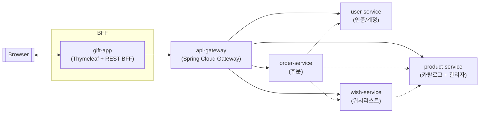

# 서비스 아키텍처 개요

## MSA 토폴로지

- **클라이언트 트래픽 경로**는 게이트웨이를 경유한 REST 계약에 한정됩니다.
- **내부 도메인 협력 경로**는 `order-service`가 상품 옵션/재고 확인 및 위시 삭제, 카카오 토큰 조회를 위해 `product-service`·`wish-service`·`user-service`를 직접 RestClient로 호출하고, `wish-service`가 위시 추가/조회 시 `product-service`를 조회합니다.
- 각 서비스는 자체 스택으로 독립 배포되며, K8s `deployment.yml`에서 동일 네임스페이스(`gift-service`) 안에 배포됩니다.
- **단일 진입점 + 헤더 기반 아이덴티티 전파**: 인증을 API Gateway에서 검증·전파해 각 도메인 서비스는 헤더 계약만 신뢰하면 됩니다.
- **역할 기반 보호**: 상품 관리자 API에 한정해 `X-Member-Role`을 검사하므로, 현재 역할 검증 범위를 구분했습니다.
- **확장 여지**: 신규 도메인 서비스 추가 시 게이트웨이에 라우트만 정의하면 외부 트래픽 연결이 가능하며, 내부 협력이 필요할 경우 RestClient 기반 계약을 추가해 점진적으로 확장할 수 있습니다.

## 서비스 역할과 의존 관계
- **gift-app (BFF + UI)**
  - 사용자와 최초로 맞닿는 서버 렌더링 UI이자 REST BFF입니다. `api.gateway.uri`를 베이스로 RestClient를 구성해 상품/위시/주문/회원 API를 모두 게이트웨이 경유로 호출합니다.
  - 게이트웨이와 동일한 JWT를 그대로 실어 보내며 별도의 인증 로직을 두지 않아, 인증 책임이 게이트웨이에 집중됩니다.
  - 화면 흐름과 API 호출을 한 프로젝트에서 관리해, 프런트와 백 간 계약 변경 시 영향 범위를 좁힙니다.

- **api-gateway (보안·라우팅 단)**
  - Spring Cloud Gateway가 경로별 프록시 역할을 하며, 보호 경로에 `AuthenticationFilter`를 적용해 JWT 유효성·만료를 검사합니다.
  - 토큰에서 `id`, `role` 클레임을 추출해 `X-Member-Id`, `X-Member-Role`로 주입한 뒤 대상 서비스로 라우팅해, 모든 도메인 서비스가 동일한 헤더 계약을 신뢰하도록 만듭니다.
  - 로그인/회원가입 경로(`/api/members/login/**`, `/api/members/register/**`)는 공개 라우트로 필터가 적용되지 않습니다.

- **user-service (인증/계정)**
  - 로그인·회원가입·회원 정보 수정/삭제를 담당하고 `id`·`role`이 담긴 JWT를 발급합니다.
  - 카카오 로그인 사용자를 위한 액세스 토큰 조회 API를 제공하여 외부 OAuth 연동을 전담합니다.
  - 다른 서비스가 사용자 DB를 직접 조회하지 않도록 하며, 이후 호출은 게이트웨이가 주입한 `X-Member-*` 헤더를 신뢰하도록 설계했습니다.

- **product-service (카탈로그 + 관리자)**
  - 공개 카탈로그 조회와 관리자 CRUD API를 분리해 제공하며, 일반 조회는 `/api/products`, 관리 기능은 `/api/admin/products`로 노출됩니다.
  - 관리자 경로에서 `X-Member-Role`이 `ADMIN`인지 인터셉터로 검사해 역할 기반 보호를 강제합니다.
  - 상품·옵션 도메인을 한 서비스에 묶어 카탈로그 변경 시 다른 마이크로서비스를 건드리지 않도록 경계를 설정했습니다.

- **wish-service (회원 위시리스트)**
  - `X-Member-Id`를 요청 헤더로 받아 회원 스코프를 구분한 CRUD/페이지네이션 API를 제공합니다.
  - 위시 데이터가 상품/주문과 느슨하게 연결되므로, 카탈로그·주문 변경과 독립적으로 배포할 수 있습니다.

- **order-service (주문 생성)**
  - 주문 생성 시 호출자 `X-Member-Id`를 받아 주문을 생성하고 응답을 반환합니다.
  - 주문 요청을 처리하면서 상품 옵션 상세·재고 차감, 주문 후 위시 삭제, 카카오 메시지 발송을 위해 `product-service`, `wish-service`, `user-service`를 RestClient로 직접 호출합니다. 이때 내부 통신에는 게이트웨이 인증 헤더를 사용하지 않습니다.
  - 주문 생성 로직을 별도 서비스로 두어 결제/메시징 로직을 독립적으로 확장할 수 있지만, 재고/회원/위시 데이터에 대한 내부 호출 실패 시 주문 실패 또는 보상 로직이 필요합니다.

## 인증 흐름
1. **회원가입·로그인 (공개 경로)**
   - `gift-app`이 `/api/members/register`, `/api/members/login`을 게이트웨이에 호출합니다.
   - 게이트웨이는 공개 라우트로 분류해 필터를 생략하고 `user-service`로 전달합니다.
   - `user-service`가 자격 증명을 검증해 만료 시간이 포함된 JWT를 발급합니다.

2. **인증이 필요한 호출**
   - 이후 모든 REST 호출은 `Authorization: Bearer <token>`을 포함한 채 게이트웨이로 전달됩니다.
   - `AuthenticationFilter`가 토큰 유효성을 검사한 뒤 `X-Member-Id`, `X-Member-Role`로 정보를 주입하고 대상 서비스로 라우팅합니다.
   - 도메인 서비스는 이 헤더를 신뢰 경계로 삼아 역할/사용자 스코프를 판단합니다.

## 배포 및 운영
- `k8s/deployment.yml`에 모든 컴포넌트의 Deployment/Service가 한 네임스페이스로 정의되며, `ConfigMap`으로 내부 주소를, `Secret`으로 JWT/Kakao 민감값을 주입합니다.
- 컨테이너 이미지는 `latest` 태그로 배포하도록 설정돼 있어, 실제 운영에서는 빌드 버전 태그를 고정하는 방식으로 변경될 필요가 있습니다.
