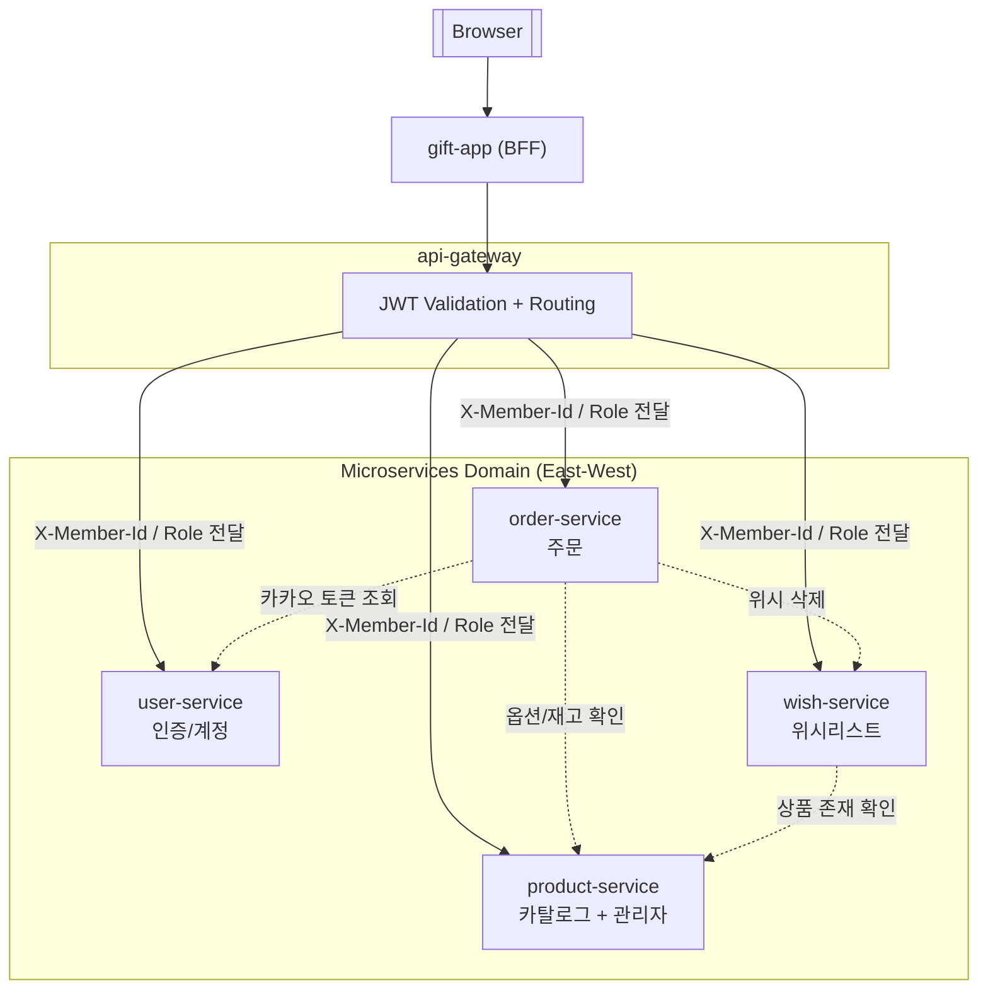

# 서비스 아키텍처 개요

## MSA 토폴로지

- **내부 도메인 East-West Traffic**:
  - 각 마이크로서비스는 자신의 도메인 책임을 유지하면서 필요한 범위에서 다른 서비스를 호출합니다.
  - order-service는 주문 생성 과정에서 상품 옵션 및 재고 검증을 위해 product-service를, 주문 완료 후 위시 정리를 위해 wish-service를, 그리고 카카오 알림 발송을 위해 user-service의 카카오 액세스 토큰 조회 API를 호출합니다.
  - 또한 wish-service는 위시 추가 및 조회 시 상품의 존재 여부 검증을 위해 product-service와 직접 통신합니다.
- **단일 진입점 기반 North-South 트래픽**:
  - 모든 외부 요청은 API Gateway를 통해 유입되며, 게이트웨이는 요청 경로에 따라 각 도메인 서비스로 라우팅합니다.
- **JWT 중앙 검증 + 헤더 기반 사용자 식별 전파**:
  - JWT 검증 책임은 API Gateway에만 존재합니다.
  - 게이트웨이는 토큰 검증 후 사용자 식별 정보와 역할을 X-Member-Id, X-Member-Role 헤더로 변환하여 각 서비스로 전달합니다.
  - 도메인 서비스는 JWT를 직접 처리하지 않고 헤더 계약만을 신뢰함으로써 인증 로직을 제거하고 비즈니스 로직에 집중할 수 있도록 설계되었습니다.
- **확장 여지**:
  - 신규 도메인 서비스 추가 시 게이트웨이에 라우트만 정의하면 외부 트래픽 연결이 가능하며, 내부 협력이 필요할 경우 RestClient 기반 계약을 통해 점진적으로 East-West 통신을 확장할 수 있습니다.

## 서비스 구성 요소
- **gift-app (BFF + UI)**
  - 사용자와 최초로 맞닿는 서버 사이드 렌더링 뷰이자 BFF(Backend-For-Frontend)입니다. `api.gateway.uri`를 베이스로 RestClient를 구성해 상품/위시/주문/회원 API를 모두 게이트웨이 경유로 호출합니다.
  - 게이트웨이와 동일한 JWT를 그대로 실어 보내며 별도의 인증 로직을 두지 않아, 인증 책임이 게이트웨이에 집중됩니다.
  - 화면 흐름과 API 호출을 한 프로젝트에서 관리해, 프런트와 백 간 계약 변경 시 영향 범위를 좁힙니다.

- **api-gateway (보안·라우팅 단)**
  - Spring Cloud Gateway를 이용해 외부 요청을 내부 서비스로 라우팅하며, CORS 설정과 JWT 인증/권한 필터를 전역적으로 적용합니다. 보호 경로에 `AuthenticationFilter`를 적용해 JWT 유효성·만료를 검사합니다.
  - 토큰에서 `id`, `role` 클레임을 추출해 `X-Member-Id`, `X-Member-Role`로 주입한 뒤 대상 서비스로 라우팅해, 모든 도메인 서비스가 동일한 헤더 계약을 신뢰하도록 만듭니다.
  - 로그인/회원가입 경로(`/api/members/login/**`, `/api/members/register/**`)는 공개 라우트로 필터가 적용되지 않습니다.

- **user-service (인증/계정)**
  - 로그인·회원가입·회원 정보 수정/삭제를 담당하고 JWT 토큰 생성기(JwtUtil)를 통해 사용자 ID와 역할, 이메일을 서명된 토큰에 포함해 반환합니다.
  - 카카오 로그인 사용자를 위한 액세스 토큰 조회 API를 제공하여 외부 OAuth 연동을 전담합니다.
  - 다른 서비스가 사용자 DB를 직접 조회하지 않도록 하며, 이후 호출은 게이트웨이가 주입한 `X-Member-*` 헤더를 신뢰하도록 설계했습니다.

- **product-service (카탈로그 + 관리자)**
  - 공개 카탈로그 조회와 관리자용 CRUD API를 분리해 제공하며, 일반 조회는 `/api/products`, 관리자 기능은 `/api/admin/products`로 노출됩니다.
  - 관리자 경로에서 `X-Member-Role`이 `ADMIN`인지 인터셉터로 검사합니다.
  - 상품·옵션 도메인을 한 서비스에 묶어 카탈로그 변경 시 다른 마이크로서비스를 건드리지 않도록 경계를 설정했습니다.

- **wish-service (회원 위시리스트)**
  - `X-Member-Id`를 요청 헤더로 받아 회원 스코프를 구분한 CRUD/페이지네이션 API를 제공합니다.
  - 상품이 존재하는지 확인하기 위해 product‑service에 RestClient로 직접 호출합니다.

- **order-service (주문 생성)**
  - 주문 생성 시 호출자 `X-Member-Id`를 받아 주문을 생성하고 카카오톡 알림을 전송합니다.
  - 주문 요청을 처리하면서 상품 옵션 상세·재고 차감, 주문 후 위시 삭제, 카카오 메시지 발송을 위해 `product-service`, `wish-service`, `user-service`를 RestClient로 직접 호출합니다. 이때 내부 통신에는 게이트웨이 인증 헤더를 사용하지 않습니다.
  - 재고/회원/위시 데이터에 대한 내부 호출 실패 시, 주문 실패 또는 보상 로직이 없는 점은 추후 보완되어야 합니다.

## 토큰 처리 방식과 인증 흐름
- **1. JWT 생성**
  - 사용자는 `BFF(gift-app)`를 통해 `/api/members/register` 또는 `/api/members/login`에 POST 요청을 보냅니다.
  - user‑service의 MemberService는 이메일 중복 검사 후 패스워드를 암호화하고, 역할별로 RoleType을 지정한 회원을 저장한 뒤 JWT를 발급합니다. JWT에는 subject(사용자 이메일), role과 id 클레임이 들어갑니다.

- **2. JWT 전달**
  - BFF(gift-app)는 발급받은 토큰을 HTTP Authorization 헤더(Bearer <token>)에 넣어 API Gateway를 통해 다른 API를 호출합니다.

- **3. API Gateway 인증 필터**
  - Gateway는 application.yml에서 정의한 경로`(/api/members/login/**, /api/members/register/** 제외)`에 대해 AuthenticationFilter를 적용합니다.
  - 필터는 요청 헤더에서 JWT를 추출하여 토큰이 유효한지 확인하고, 유효하지 않으면 401 응답을 반환합니다.
  - 유효하다면 토큰에서 사용자 ID와 역할을 읽어 X‑Member‑Id와 X‑Member‑Role 헤더에 설정한 뒤 내부 서비스로 전달합니다.
  - 따라서 **토큰 전체를 마이크로서비스로 전달하지 않고 필요한 정보만 헤더로 파싱해서 전달**합니다.

- **4. 서비스 내부 권한 처리**
  - 각 서비스는 X‑Member‑Id를 사용해 요청 주체를 식별합니다.
  - admin 전용 API에서는 AdminAuthorizationInterceptor가 X‑Member‑Role 헤더를 검사해 관리자 역할이 아닌 경우 예외를 발생시킵니다.
  - 각 마이크로서비스들은 JWT를 직접 검증하지 않으므로 JWT 검증 로직의 단일 책임이 게이트웨이에 집중되어 있습니다.

## 마이크로서비스 간 의존성 및 통신 흐름
- **gift‑app → API Gateway**: 모든 API 호출을 게이트웨이로 전달하며 JWT를 포함합니다.
- **API Gateway → 각 서비스**: 라우팅 룰과 필터를 통해 요청을 적절한 서비스로 전달합니다. 경로 기준으로 user‑service, product‑service, wish‑service, order‑service에 매핑하며 필터에서 인증을 수행합니다.
- **product‑service → DB**: 상품, 옵션 정보를 자체 데이터베이스에 저장합니다.
- **wish‑service → product‑service**: 상품 존재 여부를 확인하고 위시리스트 화면에 상품 정보를 추가합니다.
- **order‑service → product‑service**: 주문 시 옵션 재고를 차감하고 옵션 ID에서 상품 ID를 조회합니다.
- **order‑service → wish‑service**: 주문 완료 후 위시리스트에서 해당 상품을 삭제합니다.
- **order‑service → user‑service**: 카카오톡 메시지 전송을 위해 회원의 카카오 엑세스 토큰을 조회합니다.

## 배포 및 운영
- `k8s/deployment.yml`에 모든 컴포넌트의 Deployment/Service가 한 네임스페이스로 정의되며, `ConfigMap`으로 내부 주소를, `Secret`으로 JWT/Kakao 민감값을 주입합니다.
- 컨테이너 이미지는 `latest` 태그로 배포하도록 설정돼 있어, 실제 운영에서는 빌드 버전 태그를 고정하는 방식으로 변경될 필요가 있습니다.
