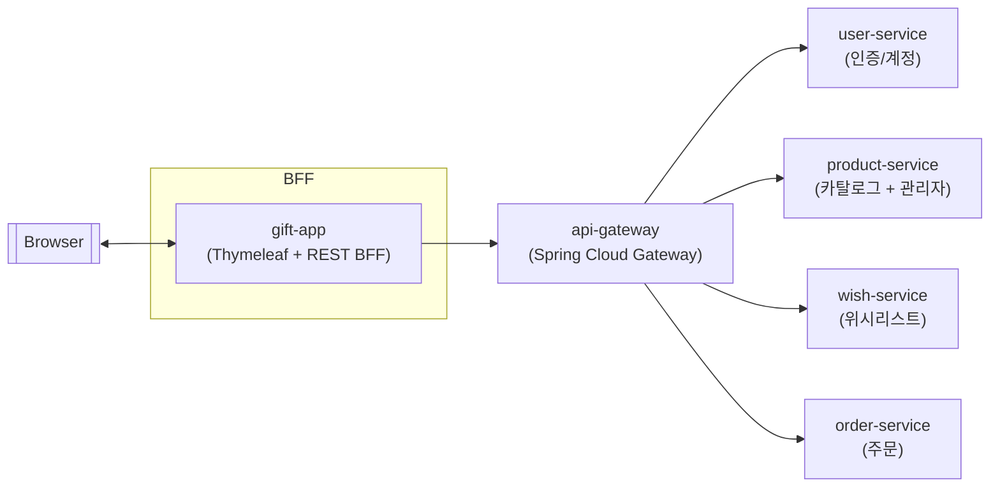

# 서비스 아키텍처 개요

## MSA 토폴로지

- 모든 도메인 서비스는 서로 직접 호출하지 않고 **게이트웨이를 경유한 REST 계약**만을 공유합니다.
- 각 서비스는 자체 스택으로 독립 배포되며, K8s `deployment.yml`에서 동일 네임스페이스(`gift-service`) 안에 배포됩니다.
- **단일 진입점 + 헤더 기반 아이덴티티 전파**: 인증을 API Gateway에서 검증·전파해 각 도메인 서비스는 헤더 계약만 신뢰하면 됩니다.
- **역할 기반 보호**: 상품 관리자 API에 한정해 `X-Member-Role`을 검사하므로, 현재 역할 검증 범위를 구분했습니다.
- **확장 여지**: 신규 도메인 서비스 추가 시 게이트웨이에 라우트만 정의하면 트래픽을 연결할 수 있는 느슨한 결합 구조입니다. 서비스 간 직접 호출이 없으므로 연쇄적인 의존을 피할 수 있지만, 추가적인 서비스 간 협력이 필요할 경우에는 계약 확장이 필요합니다.

## 서비스 역할과 의존 관계
- **gift-app (BFF + UI)**
  - 사용자와 최초로 맞닿는 서버 렌더링 UI이자 REST BFF입니다. `api.gateway.uri`를 베이스로 RestClient를 구성해 상품/위시/주문/회원 API를 게이트웨이로 호출합니다.
  - 별도의 인증 로직 없이 사용자가 받은 JWT를 HTTP 헤더에 실어 게이트웨이로 전달합니다.

- **api-gateway (보안·라우팅 단)**
  - Spring Cloud Gateway가 경로별 프록시 역할을 하며, 보호 경로에 `AuthenticationFilter`를 적용해 JWT 유효성·만료를 검사합니다.
  - 토큰에서 `id`, `role` 클레임을 추출해 `X-Member-Id`, `X-Member-Role`로 주입한 뒤 대상 서비스로 라우팅합니다.
  - 로그인/회원가입 경로(`/api/members/login/**`, `/api/members/register/**`)는 공개 라우트로 필터가 적용되지 않습니다.

- **user-service (인증/계정)**
  - 로그인·회원가입을 처리하고 `id`·`role`을 담은 JWT를 발급/검증합니다. 카카오 OAuth 액세스 토큰을 대신 받아오는 API를 제공합니다.
  - 다른 서비스가 사용자 DB에 직접 접근하지 않도록 인증·계정 책임을 독립 서비스로 분리했습니다.

- **product-service (카탈로그 + 관리자)**
  - 상품 조회와 관리자 CRUD를 노출합니다. `/api/admin/**` 요청에서 주입된 `X-Member-Role`이 `ADMIN`인지 인터셉터로 검사해 권한을 강제합니다.

- **wish-service (회원 위시리스트)**
  - `X-Member-Id`를 요청 헤더로 받아 회원 스코프를 구분한 CRUD/페이지네이션 API를 제공합니다.

- **order-service (주문 생성)**
  - 주문 생성 시 호출자 `X-Member-Id`를 받아 주문을 생성하고 응답을 반환합니다.

## 인증 흐름
1. **회원가입·로그인 (공개 경로)**
   - `gift-app`이 `/api/members/register`, `/api/members/login`을 게이트웨이에 호출합니다.
   - 게이트웨이는 공개 라우트로 분류해 필터를 생략하고 `user-service`로 전달합니다.
   - `user-service`가 자격 증명을 검증해 만료 시간이 포함된 JWT를 발급합니다.

2. **인증이 필요한 호출**
   - 이후 모든 REST 호출은 `Authorization: Bearer <token>`을 포함한 채 게이트웨이로 전달됩니다.
   - `AuthenticationFilter`가 토큰 유효성을 검사한 뒤 `X-Member-Id`, `X-Member-Role`로 정보를 주입하고 대상 서비스로 라우팅합니다.
   - 도메인 서비스는 이 헤더를 신뢰 경계로 삼아 역할/사용자 스코프를 판단합니다.

## 배포 및 운영
- `k8s/deployment.yml`에 모든 컴포넌트의 Deployment/Service가 한 네임스페이스로 정의되며, `ConfigMap`으로 내부 주소를, `Secret`으로 JWT/Kakao 민감값을 주입합니다.
- 컨테이너 이미지는 `latest` 태그로 배포하도록 설정돼 있어, 실제 운영에서는 빌드 버전 태그를 고정하는 방식으로 변경될 필요가 있습니다.
